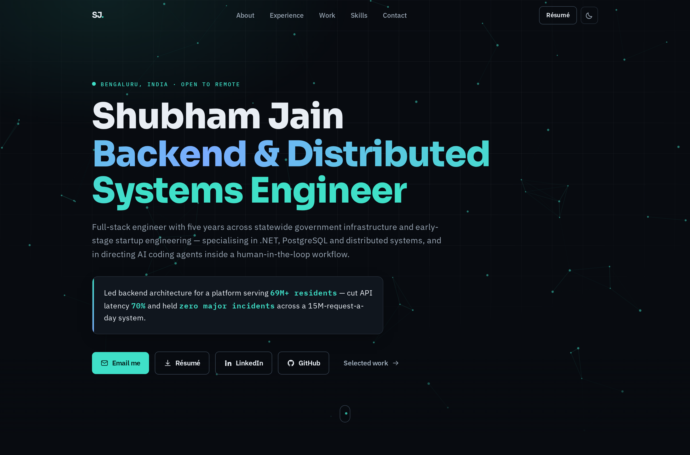
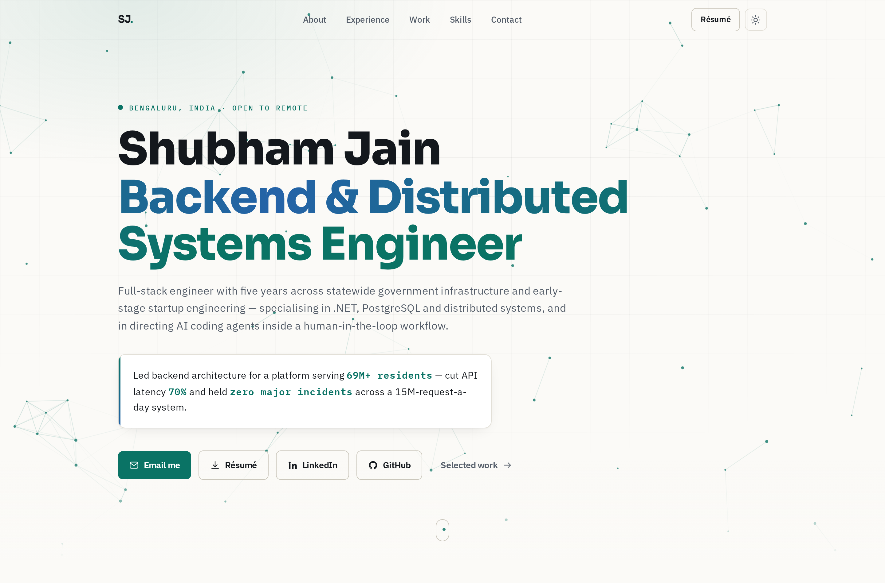
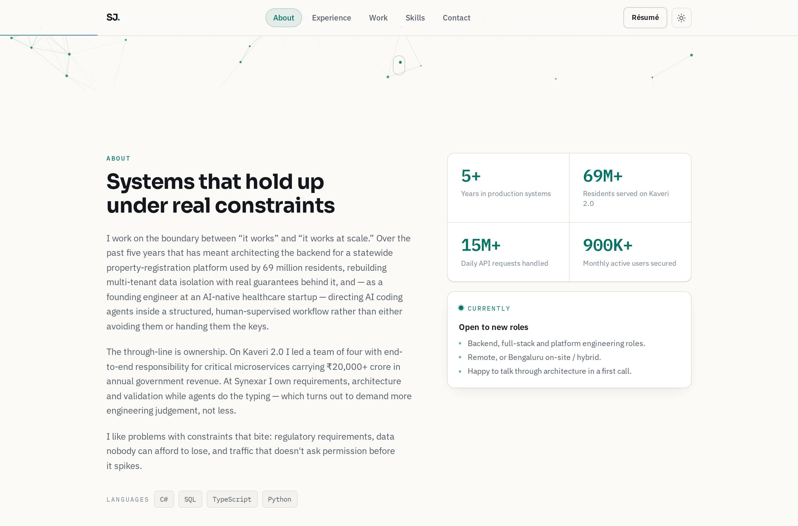
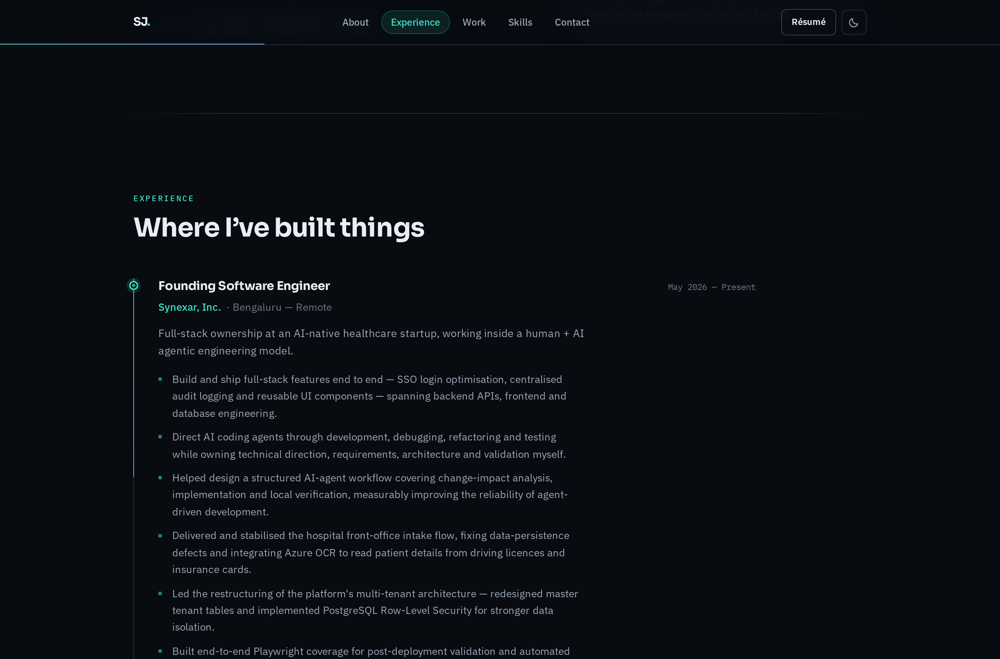
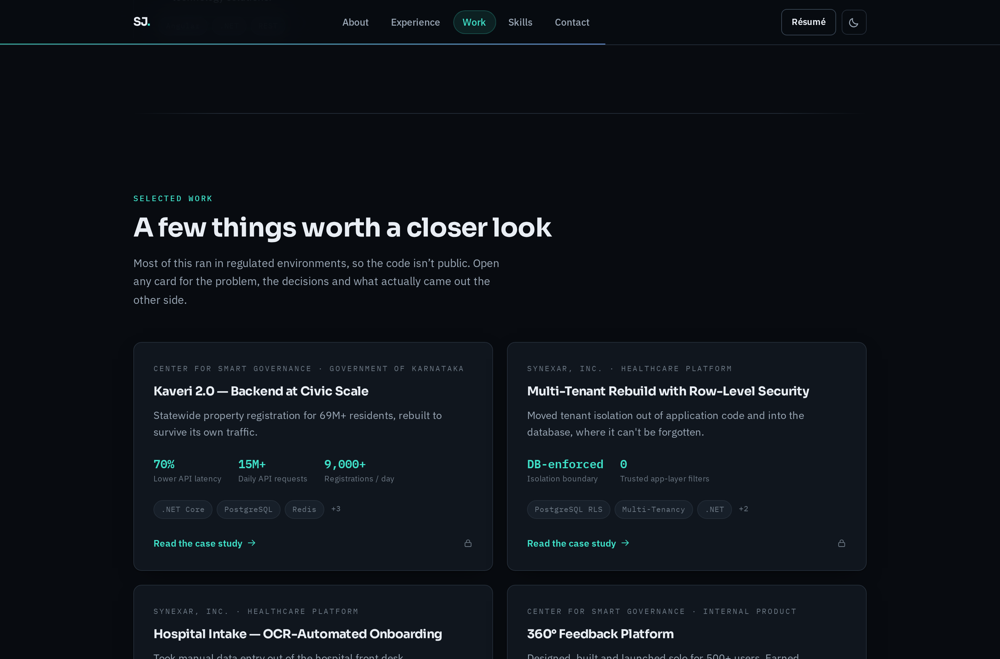
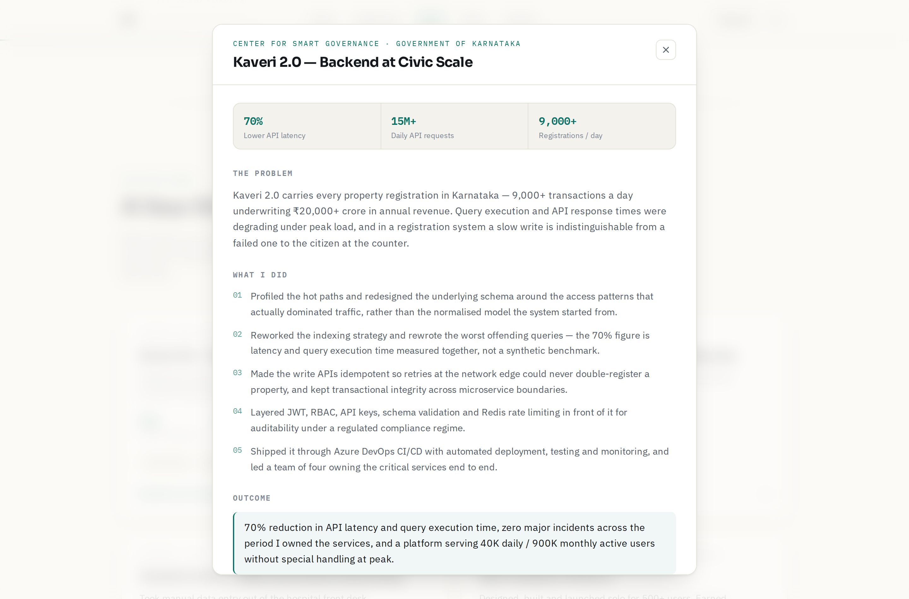
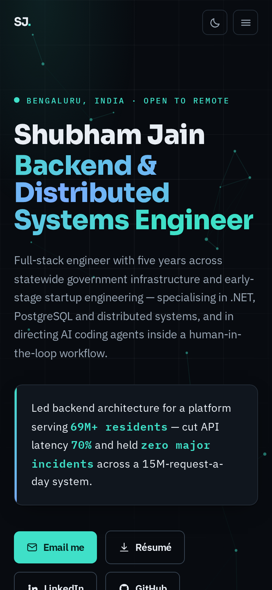

# Portfolio — build notes

**Repo:** https://github.com/shubhamjain-develops/Portfolio
**Built:** 5 September 2026

---

## Decisions

| Question | Choice |
| --- | --- |
| Stack | Next.js 15 (App Router) + React 19 + TypeScript |
| Styling | Tailwind CSS 3.4 with a CSS-variable palette |
| Animation | Framer Motion 11 — rich but restrained |
| Theme | Light + dark toggle; follows the OS on first visit, remembers the choice after |
| Work cards | GitHub links where the code is public, case-study panels where it isn't |
| Hosting | Vercel |
| Résumé | Download button in the nav, hero and footer |

---

## Screens

### Hero — dark

### Hero — light

### About

### Experience timeline

The spine draws itself as the section scrolls through the viewport.

### Selected work

### Case study panel

Opens from any work card. Focus-trapped, closes on Escape or backdrop click.

### Mobile

---

## What's animated

- Cursor-reactive constellation canvas in the hero, with scroll parallax
- Scramble-decode on the role line (real text stays in the accessibility tree throughout)
- Scroll-progress hairline along the bottom of the nav
- Sliding scroll-spy pill that tracks the section you're reading
- Count-up stat tiles that fire when they enter view
- Experience timeline spine that draws as you scroll
- Work cards with a cursor-following spotlight and a slight 3D tilt
- Magnetic buttons with a hover sheen
- Animated case-study dialog and mobile menu

Every one of these is gated on `prefers-reduced-motion` — Framer Motion components read
`useReducedMotion()`, and `globals.css` neutralises anything CSS-driven. The site is fully
usable and fully readable with motion off.

## Other things worth knowing

- **Fonts are self-hosted** (`src/fonts/*.woff2` via `next/font/local`). No request leaves
  the visitor's browser to Google, there's no extra DNS/TLS round trip on first paint, and
  the site builds with no network access.
- **schema.org `Person` JSON-LD**, sitemap, robots and an SVG favicon are all in place.
- Every route prerenders. No server-side work, no runtime data fetching.

---

## Where to edit

**All copy lives in `src/data/content.ts`.** Headline, intro, stats, jobs, case studies,
skills, credentials and contact details are typed objects there — you should never need to
open a component to change a word.

- `site.url` — set to the real domain after deploying; drives OpenGraph tags and `sitemap.xml`
- `site.github` — set to `""` and every GitHub link disappears from the site
- `site.resumePath` — points at `public/Shubham_Jain_Resume.pdf`
- `projects[].repo` / `projects[].demo` — add a URL and that case study grows a
  "View code" / "Live site" button

---

## Open items

1. **Synexar status.** The site says "May 2026 — Present" and describes a current founding
   engineer role, following the résumé. If that has ended, change `experience[0].period`,
   drop `current: true`, and adjust `site.intro` and `about.paragraphs[0]`.
2. **Résumé PDF.** `public/Shubham_Jain_Resume.pdf` was typeset to match the site (one page,
   same fonts). Swap in your own if you prefer that version — same filename, no code change.
3. **Public repos.** Nothing links to code yet. Add `repo:` to any `projects[]` entry that
   has a public repository.
